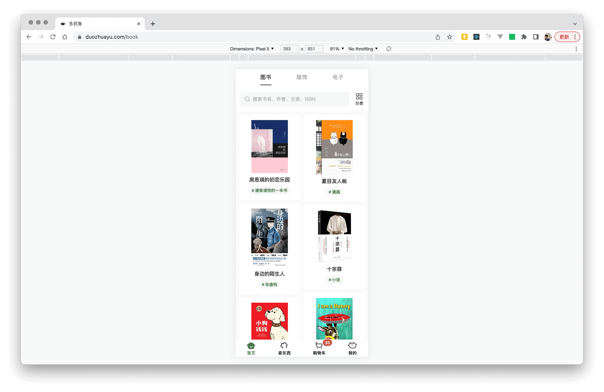

# postcss-mobile-to-multi-displays

在桌面端和移动端横屏展示移动端（竖屏）设计视图。

## 简介

移动端设计视图会按照小版心布局，居中展示在桌面端和移动端。

插件引入两个媒体查询的断点，经过一定的条件后期望覆盖：
- 移动端竖屏，正常使用移动端竖屏视图；
- 移动端横屏，使用**居中的较小固定宽度**的移动端竖屏视图；
- 平板、笔记本、桌面端，使用**居中的较大固定宽度**的移动端竖屏视图。

两个断点分别是“x 轴断点（X）”和“y 轴断点（Y）”，屏幕的高低（高度）变化触发 x 轴断点，屏幕的宽窄（宽度）变化触发 y 轴断点。默认的 x 轴断点是 640px，默认的 y 轴断点是 600px。下面是断点可能触发的每种条件以及每种条件的对应端：

```
- 宽于 Y（600）
	- 高于 X（640），使用桌面宽度（平板、笔记本、桌面端）
	- 低于 X，使用移动端横屏宽度（移动端横屏）
- 窄于 Y
	- 横屏
		- 高于 X，使用移动端横屏宽度（移动端横屏）
		- 低于 X，使用移动端横屏宽度（移动端横屏）
	- 纵屏
		- 高于 X，使用设计图宽度（移动端竖屏）
		- 低于 X，使用设计图宽度（移动端竖屏）
```

## 配置参数

下面是默认的配置参数：

```json
{
  "viewportWidth": 750,
  "desktopWidth": 600,
  "landscapeWidth": 425,
  "yAxisBreakPoint": null,
  "xAxisBreakPoint": 640,
  "rootClass": "root-class",
  "border": false,
  "disableDesktop": false,
  "disableLandscape": false
}
```

| Name | Type | isRequired | Default | Desc |
|:--|:--|:--|:--|:--|
| viewportWidth | number | N | 750 | 设计图宽度，代码中的尺寸都是基于这个宽度的尺寸 |
| desktopWidth | number | N | 600 | 适配到桌面端时，展示的视图宽度 |
| landscapeWidth | number | N | 425 | 适配到移动端横屏时，展示的视图宽度 |
| yAxisBreakPoint | number | N | / | 纵向 y 轴断点，如果不提供这个值，默认使用 `desktopWidth` 的值，视图大于这个宽度，则页面宽度是桌面端宽度 `desktopWidth`，“简介”一节具体介绍了该值的触发情况 |
| xAxisBreakPoint | number | N | 640 | 横向 x 轴断点，视图小于这个高度，并满足一定条件，则页面使用移动端横屏宽度，“简介”一节具体介绍了该值的触发情况 |
| rootClass | string | N | root-class | 页面最外层 class 选择器，用于设置在桌面端和移动端横屏时的居中样式 |
| border | boolean | N | false | 在页面外层展示边框吗，用于分辨居中的小版心布局和背景 |
| disableDesktop | boolean | N | false | 不做桌面端适配 |
| disableLandscape | boolean | N | false | 不做移动端横屏适配 |

## 输入输出样例

下面是使用默认配置的输入输出内容。

输入：

```css
.root-class {
	width: 100%;
}

.class {
	position: fixed;
	width: 100%;
}

.class2 {
	width: 100vw;
	height: 30px;
}
```

输出：

```css
.root-class {
	width: 100%;
}

.class {
	position: fixed;
	width: 100%;
}

.class2 {
	width: 100vw;
	height: 30px;
}

/* 桌面端媒体查询 */
@media (min-width: 600px) and (min-height: 640px) { /* 这里的 600 是默认值，可以自定义 */
	.root-class {
		max-width: 600px;
	}

	.class {
		width: 600px; /* 100% -> 600px */
	}

	.class2 {
		width: 600px; /* 100vw -> 600px */
		height: 24px; /* 600/750*30=24，600 是默认的桌面端预期宽度，750 是默认的设计图宽度 */
	}
}

/* 移动端媒体查询 */
@media ((min-width: 600px) and (max-height: 640px)) or ((max-width: 600px) and (orientation: landscape)) { /* 这里的 640 是固定值 */
	.root-class {
		max-width: 450px;	
	}

	.class {
		width: 450px; /* 100% -> 450px */
	}
	
	.class2 {
		width: 450px; /* 100vw -> 450px */
		height: 18px; /* 450/750*30=18 */
	}
}

/* 桌面端和移动端公共的媒体查询 */
@media (min-width: 600px) or ((orientation: landscape) and (max-width: 600px)) {
	.root-class {
		margin-left: auto !important;
		margin-right: auto !important;
		box-sizing: content-box;
		border-left: 1px solid #eee;
		border-right: 1px solid #eee;
		min-height: 100vh;
		height: auto !important;	
	}

	.class {
		position: fixed;
		margin-left: auto;  /* 用于居中 */
		margin-right: auto; /* 用于居中 */
		left: 0;            /* 用于居中 */
		right: 0;           /* 用于居中 */
	}
}
```

## 期望效果

在不同设备上，[*duozhuayu.com*](duozhuayu.com) 的官网具有一致的 UI，都偏向于移动端竖屏视图，这里用它作为期望目标。

下面的图片是在桌面端的效果：


下面的图片是在移动端的效果：


下面的图片是在移动端横屏时的效果：


“多抓鱼”官网的最大宽度是 600px，小于这个宽度则向内挤压，大于这个宽度则居中移动端竖屏视图。从上面的展示效果来看，在不同的设备上，这种小版心布局仍然有不错的兼容性。

这样适配：
- 保证内容可用，不会出现“大屏大字”的问题；
- 在非前端适配方案失效时，终端用户仍可访问。

## 注意事项

对于样式 `position: fixed; width: 100vw;` 会在非移动端视图中转换成固定宽度的居中样式，转换的前提 `position` 和 `width` 在同一选择器中，所以代码中使用 `fixed` 并且全宽的情况，要注意写在同一选择器中。

由于样式 `position: fixed; width: 100vw;` 会被转换为居中固定宽度的样式，因此会生成居中有关的属性，包括 `margin-left`、`margin-right`、`left`、`right`，这些属性会在对应选择器中被占用。

`root-class` 所在元素的居中属性会被占用，如果开启了 `border`，边框属性也会被占用，包括 `margin-left`、`margin-right`、`box-sizing`、`border-left`、`border-right`、`min-height`、`height`。


## 其它

配套插件：
- postcss-px-to-viewport，[*‌https://github.com/evrone/postcss-px-to-viewport/*](https://github.com/evrone/postcss-px-to-viewport/)
