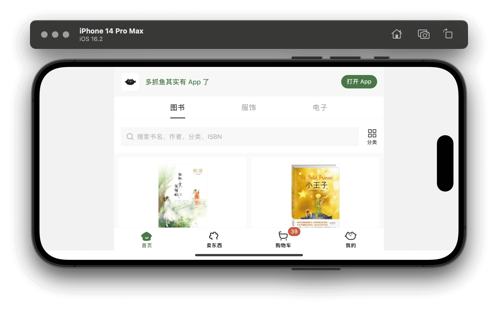
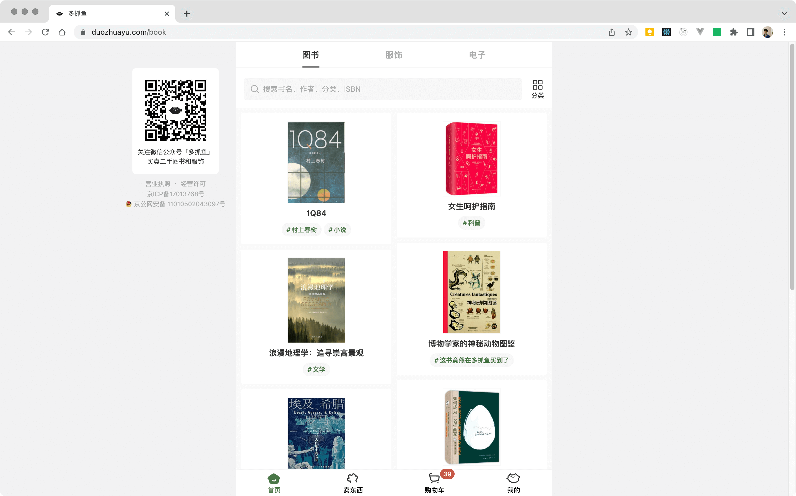

# postcss-mobile-forever


一款 PostCSS 插件，用于转换视口单位（*px->vw*），限制视图最大宽度（*min(vw, px)*），生成适应桌面端和横屏的媒体查询（*@media*）。

> 如果您在用 [postcss-px-to-viewport](https://github.com/evrone/postcss-px-to-viewport/)（后简称 *px2vw*） 实现伸缩界面的时候，不希望界面在大屏设备上撑满整个屏幕而失去可访问性，希望界面在达到某一个合适的宽度后就不再伸缩（限制最大宽度），您可以使用本插件。

您可以在线查看 [React 范例](https://wswmsword.github.io/examples/mobile-forever/react/)、[Vue 范例](https://wswmsword.github.io/examples/mobile-forever/vue/)或 [Svelte 范例](https://wswmsword.github.io/examples/mobile-forever/svelte/)，通过旋转屏幕、改变窗口大小、在不同屏幕查看展示效果。范例顶部的文字会提示您，当前的视图是移动端竖屏（Portrait）、移动端横屏（Landscape）还是桌面端（Desktop）。

## 安装

npm 安装：
```bash
## 最新的版本（postcss@^8.0.0）
npm install --save-dev postcss postcss-mobile-forever

## 最新的兼容版本（postcss@^6.0.0）
npm install postcss-mobile-forever@legacy --save-dev
```

yarn 安装：
```bash
## 最新的版本（postcss@^8.0.0）
yarn add -D postcss postcss-mobile-forever

## 最新的兼容版本（postcss@^6.0.0）
yarn add -D postcss-mobile-forever@legacy
```
<details>
<summary>
安装之后在 postcss.config.js 配置文件中引入，或者其它框架配置文件中引入。
</summary>

`postcss.config.js` 有好几种[配置格式](https://github.com/webpack-contrib/postcss-loader#config)，下面是其中一种配置方法：

```javascript
import mobile from 'postcss-mobile-forever' // <---- 这里
import autoprefixer from 'autoprefixer'
// 省略……
{
	postcss: {
		plugins: [
			autoprefixer(),
			mobile({ // <---- 这里
				rootSelector: '#app',
				viewportWidth: 375,
				border: false,
			}),
		],
	},
}
// 省略……
```
</details>

## 简介

插件使用两种方法让移动端视图处处可访问，第一种方法生成媒体查询（默认方法），第二种方法限制视口单位的最大值：
- 第一种方法**把 px 转换为用于移动端视图的视口单位，生成用于桌面端和横屏的媒体查询**，移动端视图会以两种合适的宽度，居中展示在横屏和桌面端的屏幕上，具体的媒体查询断点请查看“原理和输入输出范例”一节；
- 第二种方法**在转换 px 为视口单位的同时，限制视图的最大宽度**，当视图超过指定宽度，视图将以指定宽度居中于屏幕，这种方法的代码量相比生成媒体查询会更小。

<details>
<summary>
插件生成的媒体查询，期望覆盖手机、平板、笔记本，以及竖屏或横屏的多种屏幕。
</summary>

- 移动端竖屏，正常使用可伸缩（vw）的移动端竖屏视图；
- 移动端横屏，使用*居中的较小固定宽度*的移动端竖屏视图；
- 平板、笔记本、桌面端，使用*居中的较大固定宽度*的移动端竖屏视图；
- 穿戴设备，使用*可伸缩*（vw）的移动端竖屏视图。
</details>

> 您也可以通过配合 *px2vw*，把转换视口单位（适配移动端竖屏）的任务交给 *px2vw* 完成，然后打开本插件的 `disableMobile`，关闭本插件的视口单位转换功能。这样做只适用于上面的第一种方法，生成媒体查询的方法。

## 演示效果

下面的三张图是使用本插件后，移动端、移动端横屏和桌面端的展示效果：

<table>
	<tr>
		<td></td>
		<td></td>
	</tr>
	<tr>
		<td colspan="2"></td>
	</tr>
</table>

在“范例”一节查看，源码中提供了范例，用于在本地运行后验证演示效果，或者您也可以查看文档开头的在线范例。

## 配置参数

| Name | Type | isRequired | Default | Desc |
|:--|:--|:--|:--|:--|
| viewportWidth | number\|(file: string, selector: string) => number | N | 750 | 设计图宽度，可以传递函数动态生成设计图宽度，例如 `file => file.includes("vant") ? 375 : 750` 表示在名称包含“vant”的文件内使用 375 的设计图宽度 |
| mobileUnit | string | N | "vw" | 移动端竖屏视口视图，转换成什么视口单位？ |
| maxDisplayWidth | number | N | null | 限制视口单位的最大宽度，使用该参数不可以打开 `disableMobile` |
| desktopWidth | number | N | 600 | 适配到桌面端时，展示的视图宽度 |
| landscapeWidth | number | N | 425 | 适配到移动端横屏时，展示的视图宽度 |
| rootSelector | string | N | null | 页面最外层选择器，例如“`#app`”，用于设置在桌面端和移动端横屏时的居中样式 |
| border | boolean\|string | N | false | 在页面外层展示边框吗，用于分辨居中的小版心布局和背景，可以设置颜色字符串 |
| disableDesktop | boolean | N | false | 打开则不做桌面端适配 |
| disableLandscape | boolean | N | false | 打开则不做移动端横屏适配 |
| disableMobile | boolean | N | false | 打开则不做移动端竖屏适配，把 px 转换为视口单位，如 vw |
| exclude | RegExp\|RegExp[] | N | null | 排除文件或文件夹 |
| include | RegExp\|RegExp[] | N | null | 包括文件或文件夹 |
| unitPrecision | number | N | 3 | 单位精确到小数点后几位？ |
| propList | string[] | N | ['*'] | 哪些属性要替换，哪些属性忽略？用法参考 [postcss-px-to-viewport 文档](https://github.com/evrone/postcss-px-to-viewport/blob/HEAD/README_CN.md) |
| selectorBlackList | (string\|RegExp)[] | N | [] | 选择器黑名单，名单上的不转换 |
| valueBlackList | (string\|RegExp)[] | N | [] | 属性值黑名单，名单上的值不转换 |
| rootContainingBlockSelectorList | (string\|RegExp)[] | N | [] | 包含块是根元素的选择器列表，效果和标注注释 `/* root-containing-block */` 相同 |
| minDesktopDisplayWidth | number | N | / | 宽度断点，如果不提供这个值，默认使用 `desktopWidth` 的值，视图大于这个宽度，则页面宽度是桌面端宽度 `desktopWidth`，“原理和输入输出范例”一节具体介绍了该值的触发情况 |
| maxLandscapeDisplayHeight | number | N | 640 | 高度断点，视图小于这个高度，并满足一定条件，则页面使用移动端横屏宽度，“原理和输入输出范例”一节具体介绍了该值的触发情况 |
| side.width | number | N | 190 | 侧边配置，侧边内容宽度 |
| side.gap | number | N | 18 | 侧边配置，侧边布局的上下左右间隔 |
| side.selector1 | string | N | null | 侧边配置，左上侧边元素选择器 |
| side.selector2 | string | N | null | 侧边配置，右上侧边元素选择器 |
| side.selector3 | string | N | null | 侧边配置，右下侧边元素选择器 |
| side.selector4 | string | N | null | 侧边配置，左下侧边元素选择器 |
| comment.applyWithoutConvert | string | N | "apply-without-convert" | 自定义注释，直接添加进屏幕媒体查询，不转换 |
| comment.rootContainingBlock | string | N | "root-containing-block" | 自定义注释，包含块注释 |
| comment.notRootContainingBlock | string | N | "not-root-containing-block" | 自定义注释，非包含块注释 |
| comment.ignoreNext | string | N | "mobile-ignore-next" | 自定义注释，忽略选择器内的转换 |
| comment.ignoreLine | string | N | "mobile-ignore" | 自定义注释，忽略本行转换 |
| customLengthProperty | any | N | | 用于指定需要添加到桌面端或横屏的自定义变量（css 变量，var(...)），如果不指定，默认**所有**和长度有关的属性，如果使用了自定义变量，都会被添加入桌面端和横屏 |
| (c...y).rootContainingBlockList_LR | string[] | N | [] | 用于根包含块的，left、right 的自定义属性，例如设置 `["--len-a", "--len-b"]` 后，`--len-a` 和 `--len-b` 的值会转换为用于 `left` 和 `right` 属性，并且包含块是根包含块的值，并添加到桌面端和横屏中 |
| (c...y).rootContainingBlockList_NOT_LR | string[] | N | [] | 用于根包含块的，非 left、right 的自定义属性 |
| (c...y).ancestorContainingBlockList | string[] | N | [] | 用于非根包含块的自定义属性 |
| experimental.extract | boolean | N | false | 提取桌面端与横屏样式代码，用于生产环境，用于代码分割优化产包，具体查看“注意事项”一节 |

> 插件默认将生成桌面端和横屏的媒体查询，可以通过参数 `disableDesktop` 和 `disableLandscape` 关闭。通过设置 `maxDisplayWidth`，并打开 `disableDesktop` 和 `disableLandscape`，这种方法不会生成媒体查询，但是同样会限制视口宽度。

<details>
<summary>
查看默认的配置参数。
</summary>

```json
{
  "viewportWidth": 750,
  "maxDisplayWidth": null,
  "desktopWidth": 600,
  "landscapeWidth": 425,
  "minDesktopDisplayWidth": null,
  "maxLandscapeDisplayHeight": 640,
  "rootSelector": null,
  "border": false,
  "disableDesktop": false,
  "disableLandscape": false,
  "disableMobile": false,
  "exclude": null,
  "include": null,
  "unitPrecision": 3,
  "selectorBlackList": [],
  "valueBlackList": [],
  "rootContainingBlockSelectorList": [],
  "propList": ['*'],
  "mobileUnit": "vw",
  "side": {
    "width": 190,
    "gap": 18,
    "selector1": null,
    "selector2": null,
    "selector3": null,
    "selector4": null
  },
  "comment": {
    "applyWithoutConvert": "apply-without-convert",
    "rootContainingBlock": "root-containing-block",
    "notRootContainingBlock": "not-root-containing-block",
    "ignoreNext": "mobile-ignore-next",
    "ignoreLine": "mobile-ignore"
  },
  "customLengthProperty": {
    "rootContainingBlockList_LR": [],
    "rootContainingBlockList_NOT_LR": [],
    "ancestorContainingBlockList": []
  },
  "experimental": {
    "extract": false
  }
}
```

</details>

<details>
<summary>
虽然配置选项的数量看起来很多，但是只需要指定选项 rootSelector 和 viewportWidth 后，就可以输出适配竖屏、横屏和桌面端的结果。在桌面端和横屏的视图下，如果有样式和移动端竖屏不一致，再考虑配置其它选项。
</summary>

下面的配置会适配桌面端和横屏，桌面端视图的宽度是 600px，横屏的宽度是 425px：
```json
{
  "viewportWidth": 750,
  "rootSelector": "#app"
}
```

下面的配置会限制视口单位的最大值，当屏幕宽度超过 600px 后，视图不会再变化：
```json
{
  "viewportWidth": 750,
  "maxDisplayWidth": 600,
  "rootSelector": "#app",
  "disableDesktop": true,
  "disableLandscape": true
}
```

</details>

标记注释：
- `/* apply-without-convert */`，将属性不经过转换，直接添加到桌面端和横屏（可用于属性覆盖的情况）；
- `/* root-containing-block */`，标记在选择器上面，用于表示当前选择器的包含块是根元素，是浏览器窗口（如果选择器中已有“`position: fixed;`”，则无需标注该注释）；
- `/* not-root-containing-block */`，标记在选择器上面，用于表示当前选择器所属元素的包含块不是根元素；
- `/* mobile-ignore-next */`，标记在一行属性的上面，表示下一行属性不需要进行转换；
- `/* mobile-ignore */`，标记在一行属性后面，表示当前行属性不需要进行转换。

## 单元测试

```bash
npm install
npm run test
```

## 范例

文件夹 `example` 内提供了分别在 [React](https://reactjs.org/)、[Svelte](https://svelte.dev/) 和 [Vue](https://cn.vuejs.org/) 中使用 `postcss-mobile-forever` 的范例，通过命令行进入对应的范例文件夹中，即可运行：

```bash
cd example/react/
npm install
npm run start
```

在“演示效果”一节中查看成功运行之后，不同屏幕的界面图片。

## 原理和输入输出范例

查看[原理](./how-to-work.md)。

默认配置的输入范例：

```css
.root-class {
	width: 100%;
}

.nav {
	position: fixed;
	width: 100%;
	height: 72px;
	left: 0;
	top: 0;
}
```

默认配置的输出范例：

```css
#app {
	width: 100%;
}

.nav {
	position: fixed;
	width   : 100%;
	height  : 9.6vw;
	left    : 0;
	top     : 0;
}

/* 桌面端媒体查询 */
@media (min-width: 600px) and (min-height: 640px) { /* 这里的 600 是默认值，可以自定义 */
	#app {
		max-width: 600px !important;
	}

	.nav {
		height: 57.6px;
		top: 0;
		left  : calc(50% - 300px); /* calc(50% - (600 / 2 - 0 * 600 / 750)px) */
		width : 600px; /* 100% -> 600px */
	}
}

/* 移动端媒体查询 */
@media (min-width: 600px) and (max-height: 640px),
(max-width: 600px) and (min-width: 425px) and (orientation: landscape) { /* 这里的 640 和 425 是默认值，可自定义 */
	#app {
		max-width: 425px !important;
	}

	.nav {
		height: 40.8px;
		top: 0;
		left  : calc(50% - 212.5px); /* calc(50% - (425 / 2 - 0 * 425 / 750)px) */
		width : 425px; /* 100% -> 425px */
	}
}

/* 桌面端和移动端公共的媒体查询 */
@media (min-width: 600px),
(orientation: landscape) and (max-width: 600px) and (min-width: 425px) {
	#app {
		margin-left: auto !important;
		margin-right: auto !important;
	}
}
```

<details>
<summary>查看使用选项 maxDisplayWidth 限制宽度，关闭媒体查询的输出范例。</summary>

配置：
```json
{
  "rootSelector": "#app",
  "maxDisplayWidth": 560,
  "disableDesktop": true,
  "disableLandscape": true,
}
```

输出范例
```css
#app {
  width       : 100%;
  max-width   : 560px !important;
  margin-left : auto !important;
  margin-right: auto !important;
}

.nav {
  position: fixed;
  width   : min(100%, 560px);
  height  : min(9.6vw, 53.76px);
  left    : calc(50% - min(50%, 280px));
  top     : 0;
}
```
</details>

## 注意事项

rootSelector 所在元素的居中属性会被占用，如果开启了 `border`，边框属性也会被占用，包括 `margin-left`、`margin-right`、`box-sizing`、`border-left`、`border-right`、`min-height`、`height`。

默认情况，插件会把所有 fixed 定位的元素的包含块当成根元素，如果希望跳过处理非根元素的包含块，请在选择器上方添加注释，`/* not-root-containing-block */`，这样设置后，插件会知道这个选择器内的计算方式统一使用非根包含块的计算方式：

```css
/* not-root-containing-block */
.class {
	position: fixed;
	left: 50%;
}
```

> 对于 fixed 定位元素的包含块是祖先元素，而不是根元素（浏览器窗口，visual viewport）的条件，请查看“其它”一节。

<details>
<summary>
对于包含块，如果“position: fixed;”和“left: 0;”不在同一选择器，可以在需要重新计算的选择器上标记注释“/* root-containing-block */”（另一个方法是设置“rootContainingBlockSelectorList”参数）。
</summary>

```css
.position {
	position: fixed;
}
/* root-containing-block */
.top-box {
	right: 0;
	bottom: 0;
	width: 66px;
	height: 66px;
	border-radius: 9px;
}
```
</details>

插件暂时不支持转换和包含块的 `logical-width`、`logical-height`、`block-size`、`inline-size` 有关的属性。

插件转换的是选择器中的属性的值，不转换 [At 规则](https://developer.mozilla.org/zh-CN/docs/Web/CSS/At-rule)中的属性，例如 `@font-face` 中的属性。

关于 `experimental.extract` 选项：
- 打开选项后，样式文件会被分割为 `mobile.xxx.css`、`landscape.xxx.css` 和 `desktop.xxx.css`，这有利于使用代码分割进行产包优化;
- 该选项需要设置 [css-loader](https://github.com/webpack-contrib/css-loader) 的 `modules.getLocalIdent` 选项，需要从本插件导入 `remakeExtractedGetLocalIdent` 函数进行传递，这是为了防止选择器名称中的哈希值出现错误（哈希值会通过文件路径计算，而被分割的文件路径是不同的）；
- 暂时不支持热重载，可以仅在生产模式下打开该选项；
- 被分割的文件暂时不支持运行本插件（postcss-mobile-forever）后面的其它 postcss 插件；
- 如果使用 [HtmlWebpackPlugin](https://github.com/jantimon/html-webpack-plugin) 自动插入样式产包，需要注意顺序，顺序可以通过 `optimization.splitChunks.cacheGroups.[group].priority` 来决定，优先级越高，插入到 html 的顺序越靠前。

<details>
<summary>查看使用 `experimental.extract` 的一份范例配置。</summary>

```javascript
const path = require("path");
const MiniCssExtractPlugin = require("mini-css-extract-plugin");
const { defaultGetLocalIdent } = require("css-loader");
const { remakeExtractedGetLocalIdent } = require("postcss-mobile-forever");

const isProdMode = process.env.NODE_ENV === "production";

module.exports = {
  mode: isProdMode ? "production" : "development",
  entry: "./src/index.js",
  output: {
    filename: "[name].js",
    path: path.resolve(__dirname, "build"),
    clean: true,
  },
  module: {
    rules: [
      {
        test: /\.css$/,
        use: [isProdMode ? MiniCssExtractPlugin.loader : "style-loader", {
          loader: "css-loader",
          options: {
            modules: {
              localIdentName: isProdMode ? "[hash:base64]" : "[path][name]__[local]",
              getLocalIdent: isProdMode ? remakeExtractedGetLocalIdent({ defaultGetLocalIdent }) : undefined, // 开发环境不分割，因此设置为 undefined
            },
          }
        }, {
          loader: "postcss-loader",
          options: {
            postcssOptions: [
              ["postcss-mobile-forever", {
                rootSelector: ".root-class",
                experimental: {
                  extract: isProdMode, // 生产环境打开文件的提取
                },
              }]
            ]
          }
        }],
      }
    ],
  },
  optimization: {
    splitChunks: {
      cacheGroups: {
        desktop: {
          chunks: "all",
          enforce: true,
          test: /desktop[^\\/]*?\.css$/, // 分割桌面端样式
          name: "desktop",
          priority: 101, // 第三位被加载
        },
        landscape: {
          chunks: "all",
          enforce: true,
          test: /landscape[^\\/]*?\.css$/, // 分割横屏样式
          name: "landscape",
          priority: 102, // 第二位被加载
        },
        mobile: {
          chunks: "all",
          enforce: true,
          test: /mobile[^\\/]*?\.css$/, // 分割移动端样式
          name: "mobile",
          priority: 103, // 第一位被加载
        },
      }
    }
  },
};
```

前往[范例](./example/cases/split-chunks/react/)查看可运行的配置。

</details>

<details>
<summary>
关于 css 自定义属性，默认情况下，所有和长度相关的属性，如果使用了自定义属性，都会被添加入桌面端和横屏，这可能会带来一些冗余的添加，也可能会有一些转换的错误，转换的错误和包含块相关。
</summary>

下面的例子，默认的情况，`--len-a` 的值在桌面端会被转为 `60px`，横屏会被转为 `42.5px`，但是可以看到实际的应用场景中，定位是 fixed，因此包含块是根包含块，所以默认的转换是错误的，正确的转换应该是，桌面端会被转为 `calc(50% - 240px)`，横屏会被转为 `calc(50% - 170px)`。
```css
:root {
  --len-a: 75px;
}
.rule {
  left: var(--len-a);
  position: fixed;
}
```

上面的例子中，如果要正确的转换，需要在配置中明确指定，`--len-a` 用于根包含块，并且被用于 `left` 属性：
```javascript
{
  // ...其它配置
  customLengthProperty: {
    rootContainingBlockList_LR: ["--len-a"],
  }
}
```

</details>

本插件的目标是在不同尺寸的屏幕上展示**合适**的视图，在宽一点的屏幕上展示大一点的视图，在扁一点的屏幕上展示小一点的视图，在窄一些的屏幕展示移动端竖屏视图，而**非准确**地识别具体的设备或平台来应用对应视图。

## 期望效果

在不同设备上，[*duozhuayu.com*](https://www.duozhuayu.com/book) 做得很好，桌面端和移动端虽然基本公用一套 UI（移动端竖屏 UI），但访问无障碍，没有巨大字体和全宽的问题。

<details>
<summary>
查看“多抓鱼“在移动端、移动端横屏和桌面端的展示效果。
</summary>
<table>
	<tr>
		<td></td>
		<td></td>
	</tr>
	<tr>
		<td colspan="2"></td>
	</tr>
</table>

</details>

“多抓鱼”官网用百分比单位做适配，最大宽度是 600px，小于这个宽度则向内挤压，大于这个宽度则居中移动端竖屏视图。从上面的展示效果来看，在不同的设备上，这种小版心布局仍然有不错的兼容性和展示效果。虽然百分比单位牺牲了一点“完美还原度”，但是从灵活度和代码轻量的角度看，是个不错的选择。

这样适配：
- 保证内容可用，不会出现视口单位导致的“大屏大字”问题；
- 在非前端适配方案失效时，前端有兜底自适应适配，终端用户仍可访问。

## CHANGELOG

查看[更新日志](./CHANGELOG.md)。

## 版本规则

查看[语义化版本 2.0.0](https://semver.org/lang/zh-CN/)。

## 协议

查看 [MIT License](./LICENSE)。

## 其它

可以配合使用的项目：
- postcss-px-to-viewport，[*‌https://github.com/evrone/postcss-px-to-viewport*](https://github.com/evrone/postcss-px-to-viewport)，postcss 插件，用于将指定单位转为视口单位。
- postcss-extract-media-query，[*https://github.com/SassNinja/postcss-extract-media-query*](https://github.com/SassNinja/postcss-extract-media-query)，postcss 插件，用于分离媒体查询。
- media-query-plugin，[*https://github.com/SassNinja/media-query-plugin*](https://github.com/SassNinja/media-query-plugin)，webpack 插件，用于分离媒体查询，可以配合其它 webpack 插件使用，例如 [html-webpack-plugin](https://github.com/jantimon/html-webpack-plugin)、[mini-css-extract-plugin](https://github.com/webpack-contrib/mini-css-extract-plugin)。

百分比值受包含块（Containing Block）宽度影响的属性：`left`、`margin-bottom`、`margin-left`、`margin-right`、`margin-top`、`margin`、`max-width`、`min-width`、`padding-bottom`、`padding-left`、`padding-right`、`padding-top`、`padding`、`right`、`shape-margin`、`text-indent`、`width`。

对于包含块，插件默认的处理方式不能处理下面的情况，如果某个情况设置在祖先元素上，那么当前定位为 fixed 元素的包含块就是那个祖先元素，而插件默认所有的 fixed 元素的包含块是浏览器窗口（visual viewport）：
- transform 或 perspective 的值不是 none；
- will-change 的值是 transform 或 perspective；
- filter 的值不是 none 或 will-change 的值是 filter（只在 Firefox 下生效）；
- contain 的值是 paint（例如：`contain: paint;`）；
- backdrop-filter 的值不是 none（例如：`backdrop-filter: blur(10px);`）。

相关链接：
- [Media Queries Level 3](https://www.w3.org/TR/mediaqueries-3/#syntax)，W3C Recommendation，05 April 2022；
- [CSS syntax validator](https://csstree.github.io/docs/validator.html)，遵守 W3C 标准的在线 CSS 语法检测器；
- “[What are CSS percentages?](https://jameshfisher.com/2019/12/29/what-are-css-percentages/)”，罗列了百分比取包含块（Containing Block）宽度的属性；
- [CSS 的简写属性](https://developer.mozilla.org/zh-CN/docs/Web/CSS/Shorthand_properties)，罗列了所有的简写属性；
- [postcss-bud](https://github.com/wswmsword/postcss-bud)，一款 PostCSS 插件，用于保持视图横竖居中于屏幕；
- [CSS3 Media Queries overview](http://cssmediaqueries.com/overview.html)，一个网站，展示本机当前应用的媒体查询；
- “[Don't target specific devices or sizes!](https://stackoverflow.com/a/20350990)”，一条答案，解释为什么不应该通过设备类型适配界面；
- [Media Queries for Standard Devices](https://css-tricks.com/snippets/css/media-queries-for-standard-devices/)，罗列了各种屏幕的媒体查询；
- [响应式设计](https://developer.mozilla.org/zh-CN/docs/Learn/CSS/CSS_layout/Responsive_Design)，MDN 的响应式设计教程。
