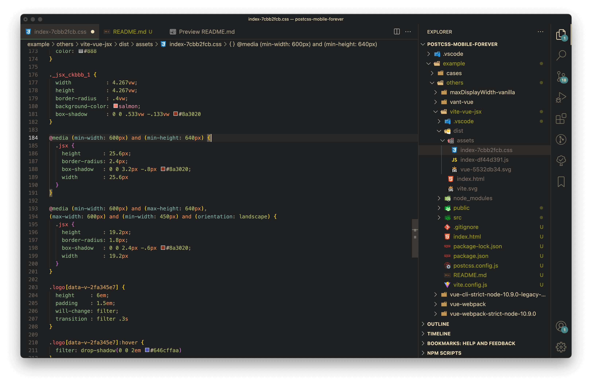
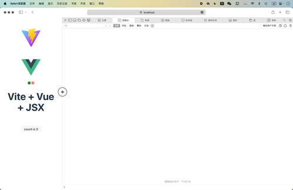

# Vue 3 + Vite + JSX

## 介绍

运行之后，界面将出现一个绿色方块和一个红色方块，同时项目中使用了一个 PostCSS 插件，[postcss-mobile-forever](https://github.com/wswmsword/postcss-mobile-forever)，该插件的预期效果是期望两个方块的大小是伸缩的，但是当宽度大于一定宽度，或者说大于一般手机屏幕的宽度之后，方块的大小将不再变化。

实际的运行效果是，以 `.vue` 结尾的 SFC 的绿色方块组件符合预期，以 `.jsx` 结尾的 JSX 的红色方块组件不符合预期，大于手机屏幕宽度后，红色方块的大小仍然继续伸展。通过命令 `npm run build` 输出产包后，可以看到 CSS 样式文件里，[postcss-mobile-forever](https://github.com/wswmsword/postcss-mobile-forever) 生成的、用于限制红色方块最大宽度的样式的选择器名称仍是原始名称，而不是 CSS Modules 转换之后的名称。

下图展示了产包里的红色方块的样式情况，可以看到原始文件 `components/jsx/index.module.css` 的样式选择器从 `.jsx` 转为了 `._jsx_ckbbb_1`，而插件生成的、在媒体查询里的没有被转换，仍然是 `.jsx`。



<details>
<summary>查看两个方块的大小的伸缩随屏幕宽度变化的情况。</summary>



</details>

## 运行

```bash
npm i # 安装依赖
npm run dev # 本地运行
npm run build # 输出生产环境产包
```