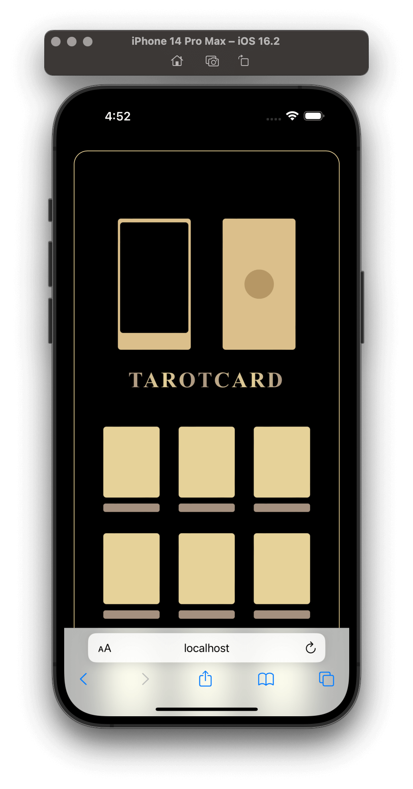
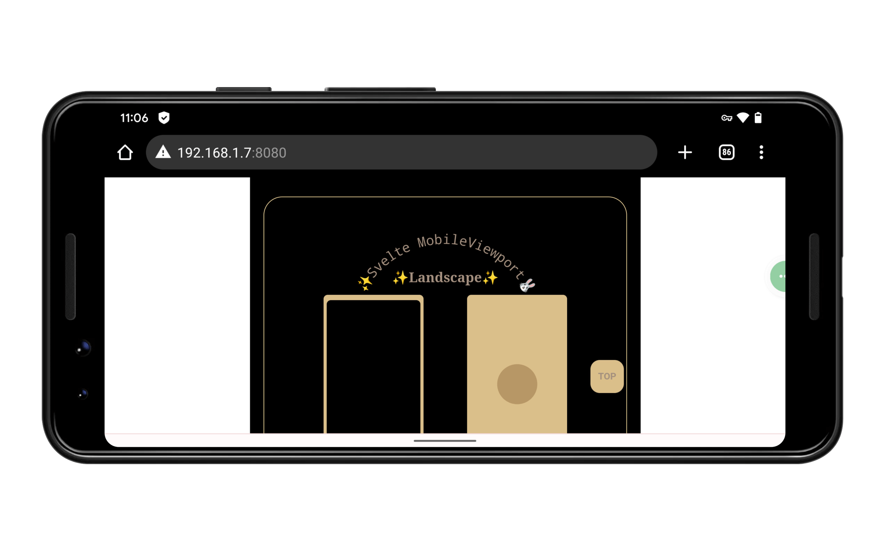
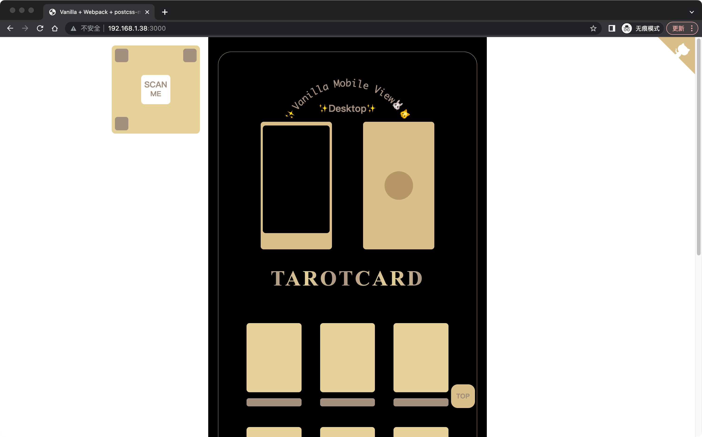

# 原理

程序运行时，会转换单位，转换哪些单位，需要进行检测，满足要求的将被转换。检测的单位有 `px`、`vw` 和 `%`，之所以检测 `vw` 和 `%`，是因为在 fixed 定位时，在宽屏上时，开发者都会希望 `%` 或 `vw` 都是基于视图的宽度计算的，也就是宽屏的时候，居中的那个移动端视图，而默认下这两个单位一般都是基于浏览器的宽度，因此需要检测，进行重新计算。

重新计算 fixed 定位的 `%` 是可行的，但是也有一种方法，可以避免转换 fixed 定位时的百分比单位，那就是主动设定视图的根元素作为包含块。使用这种方法，也不需要转换 fixed 定位的 `vw`，因为程序只做一件事情，那就是转换 `px`，其它的目的或意图都交给开发者，程序不需要干预，转换之后的结果仍然可以保持视图最大宽度，因为所有的 fixed 定位元素内的尺寸单位都是由浏览器基于主动设定的包含块进行计算的。

下面会介绍关于媒体查询、限制最大宽度和 fixed 定位时的计算这三个主题。

---

本插件会创建可以代表桌面端和移动端横屏的两个媒体查询，然后找到所有的 px 值进行转换，默认情况会把原值转换成两个经过比例计算后的新 px 值，分别对应桌面端和移动端横屏。

<details>
<summary>
使用媒体查询限制最大宽度的方法，能够为桌面端与横屏各自设置最大宽度。
</summary>

您可以查看一个[在线范例](https://wswmsword.github.io/examples/mobile-forever/vanilla/)，通过旋转屏幕、改变窗口大小、在不同屏幕查看展示效果。范例顶部的文字会提示您，当前的视图是移动端竖屏（Portrait）、移动端横屏（Landscape）还是桌面端（Desktop）。

- 移动端竖屏，正常使用可伸缩（vw）的移动端竖屏视图；
- 移动端横屏，使用*居中的较小固定宽度*的移动端竖屏视图；
- 平板、笔记本、桌面端，使用*居中的较大固定宽度*的移动端竖屏视图；
- 穿戴设备，使用*可伸缩*（vw）的移动端竖屏视图。

下面的三张图是使用本插件生成媒体查询，移动端、移动端横屏和桌面端的展示效果：

<table>
	<tr>
		<td></td>
		<td></td>
	</tr>
	<tr>
		<td colspan="2"></td>
	</tr>
</table>

在“范例”一节查看，源码中提供了范例，用于在本地运行后验证演示效果，或者您也可以查看文档开头的在线范例。
</details>

媒体查询中有两个重要因素，分别是“屏幕宽度（X）”和“屏幕高度（Y）”，分别对应了屏幕的高低（高度）变化，以及屏幕的宽窄（宽度）变化。下面是媒体查询断点的具体情况，以及和每种情况等效的端口（默认 X 是 640px，Y 是 600px，可通过参数调整）：

- 宽于 X（600）
	- 高于 Y（640），使用桌面宽度（平板、笔记本、桌面端）
	- 低于 Y，使用移动端横屏宽度（移动端横屏）
- 窄于 X
	- 横屏
		- 宽于 landscapeWidth（425），使用移动端横屏宽度（移动端横屏）
		- 窄于 landscapeWidth，使用设计图宽度（穿戴设备）
	- 纵屏，使用设计图宽度（移动端竖屏）

桌面端媒体查询类似于：

```css
@media (min-width: 600px) and (min-height: 640px) { /* ... */ }
```

移动端横屏媒体查询类似于：

```css
@media (min-width: 600px) and (max-height: 640px), (max-width: 600px) and (min-width: 425px) and (orientation: landscape) { /* ... */ }
```

---

怎样限制视口单位的最大宽度：
- 使用 CSS 函数 `min()` 或 `max()`；
- 举例，当前配置为 `{ viewportWidth: 750, maxDisplayWidth: 600 }`，
	- 转换前，`width: 75px;`，
	- 转换后，`width: min(10vw, 60px);`；
	- 对于 fixed 定位的 left 和 right 属性，有不一样的处理，
		- 例如，转换前，`left: 0;`，
		- 转换后，`left: calc(50% - min(50%, 300px));`。

除了上面利用 vw 限制最大宽度，另一种方法是使用 rem。当元素都使用 rem 作为尺寸单位时，根元素的 `font-size` 是否动态，决定了视图是否伸缩。mobile-forever 通过设置根元素的 `font-size` 为一个 vw 值，vw 的值是根据宽度变化的，因此这时 `font-size` 是动态的。mobile-forever 又利用 `media-query` 来让 `font-size` 达到某一宽度后，值变为静止的 `px`，从而达到限制伸缩视图宽度的目的。

更多有关限制视口最大宽度的信息，请查看一篇科普博文“[增强 vw/rem 移动端适配](https://juejin.cn/post/7431558902171484211)”，这篇博文也解释了如何通过 CSS 函数矫正 `fixed` 定位的元素。

---

当需要把竖屏视图居中展示时，fixed 定位的元素需要重新计算，让元素回到视图中，而不是左右的空白区域。例如 `position: fixed; left: 0;` 在宽屏上，应该处于居中的视图中，而不是屏幕最左侧。

如果元素的长度单位是百分比，那么这个百分比是基于[包含块](https://developer.mozilla.org/zh-CN/docs/Web/CSS/Containing_block)计算的。大部分情况，元素的包含块是它的父级元素，因此插件不需要进行转换，但是当元素处于 fixed 定位时，元素的包含块就可能是根元素 `<html>`（visual viewport），这时的宽度是浏览器宽度，所以插件需要把此时依赖浏览器宽度的属性进行转换，这样不管浏览器宽度怎么变化，视图才能始终居中。

需要了解哪些属性的百分比尺寸，是基于包含块的宽度计算的，一共有下面这些属性：`left`、`margin-bottom`、`margin-left`、`margin-right`、`margin-top`、`margin`、`max-width`、`min-width`、`padding-bottom`、`padding-left`、`padding-right`、`padding-top`、`padding`、`right`、`shape-margin`、`text-indent`、`width`。

此外还有[逻辑宽高属性](https://developer.mozilla.org/zh-CN/docs/Web/CSS/CSS_logical_properties_and_values/Basic_concepts_of_logical_properties_and_values)，当 fixed 定位时，逻辑宽高属性也是基于根包含块的，具体哪个属性是基于根包含块计算，会根据书写模式切换，当横向书写模式，`inline-size` 取根包含块计算，当纵向书写模式，`block-size` 取根包含块计算。逻辑属性不只上面提到的两个，大体这些属性名称都包含 *inline* 和 *block*，具体可以查看 `constants.js` 内的 `horisontalContainingBlockLogicalProps` 和 `verticleContainingBlockLogicalProps`。

下面是具体的计算方法，媒体查询模式下的计算方法（fixed 定位的元素，其百分比宽度大部分情况依赖浏览器宽度，但也存在特殊情况，请查看“注意事项”一节来应对特殊情况）：
- 属性是除了 left 和 right 的属性，单位使用 vw 或百分号（%），
	- 计算方式为 `(idealClientWidth / 100 * number)px`；
- 属性是除了 left 和 right 的属性，单位使用 px，
	- 计算方式为 `(idealClientWidth / viewportWidth * number)px`；
- 属性为 left 或 right，单位使用 vw 或百分号，
	- 计算方式为 `calc(50% - (idealClientWidth / 2 - idealClientWidth / 100 * number)px)`；
- 属性为 left 或 right，单位使用 px，
	- 计算方式为 `calc(50% - (idealClientWidth / 2 - number * idealClientWidth / viewportWidth)px)`。

<details>
<summary>查看关于上述包含块内单位转换的更多解释。</summary>

- idealClientWidth（理想客户端宽度）是属性表中的 desktopWidth 或 landscapeWidth；
- viewportWidth 即属性表中的 viewportWidth；
- number 即属性值里的长度数字；
- 对于包含块，“未考虑的其它情况”请查看“注意事项”一节，例如 `position: fixed; left: 0;` 的另一种可能是使元素处于某祖先元素的最左侧，而不是根元素（浏览器窗口）最左侧；
- 对于包含块，会有 `position: fixed;` 和 `left: 0;` 不在同一选择器的情况，这种情况仍然需要计算 `left`，但默认由于未在同一选择器中检测到 `fixed`，因此不会重新计算，应对方法请查看“注意事项”一节；
- 包含块宽度影响的属性，请查看“其它”一节；
- 以上值的重新计算，目的是保证每个端口的视图完全一致。

</details>

上面是媒体查询模式的计算方式，CSS 函数的计算方式与之不同，具体的计算方式可以直接查看另一个项目 [scale-view](https://github.com/wswmsword/scale-view) 的源码。使用 CSS 函数计算方式同样会识别 fixed 定位的尺寸单位，对于无法识别的选择器则需要手动指定，在一开始提到过，指定应用的根包含块之后，就可以避免这些问题，因此如果项目有太多的 fixed 定位元素，可以通过这个方法来省一点心，避免手动指定无法识别的 fixed 定位选择器，尚不清楚指定包含快是否会有其它副作用，例如性能。

有的选择器是 fixed 定位的，但是无法识别，例如下面这样：

```css
.fixed {
	position: fixed;
}
.full_width {
	width: 100%;
}
```

```html
<nav class="fixed full_width"></nav>
```

程序只是通过选择器内是否包含 `position: fixed` 来识别，所以上面的 `.full_width` 无法识别，但实际也需要使用 fixed 定位模式的计算方式进行计算。